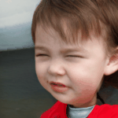
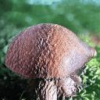
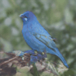

# Unsupervised Discovery of Interpretable Directions in the GAN Latent Space

Authors official implementation of the [_Unsupervised Discovery of Interpretable Directions in the GAN Latent Space_](https://arxiv.org/abs/2002.03754) (ICML 2020).

This code explores interpretable latent space directions of a pretrained GAN.


_Our approach scheme: latent deformator A aims to produce shifts that are easy to distinguish for the reconstructor R_

Here are several examples for Spectal Norm GAN (MNIST & Anime Faces), ProgGAN (CelebA-HQ) and BigGAN (ILSVRC):


## Requirements
python 3.6 or later\
jupyter (for visualization)
>torch>=1.4\
torchvision\
tqdm\
tensorboardX

see ```requirement.txt``` for exact authors environment.

## Training

Here is a minimal example of latent rectification run command:
```
python run_train.py \
    --gan_type BigGAN \
    --gan_weights <path_to_generator_weights.pth> \
    --deformator ortho \
    --out <out_dir>
```
this script will save the latent space directions stored in ``LatentDeformator`` module weights. \
It also saves images charts with latent directions examples.
```gan_type``` specifies the generator model.

## Evaluation

Run ```evaluation.ipynb``` notebook for the discovered directions inspection.

## Pre-trained Models

Comming _very_ soon

## Results

Here are some examples of generated images manipulation by moving along discovered directions:



_StyleGAN2 - FFHQ - opened eyes_



_BigBiGAN - ImageNet - light direction_



_BigGAN - ImageNet - rotation_

## Credits
BigGAN code and weights are based on the authors implementation:
https://github.com/ajbrock/BigGAN-PyTorch

ProgGAN code and weights are based on:
https://github.com/ptrblck/prog_gans_pytorch_inference

U-net segmentation model code is based on:
https://github.com/milesial/Pytorch-UNet
