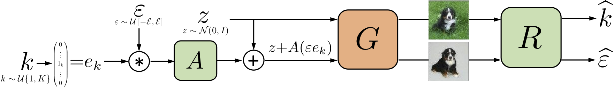

# Unsupervised Discovery of Interpretable Directions in the GAN Latent Space

Official PyTorch implementation of pre-print _Unsupervised Discovery of Interpretable Directions in the GAN Latent Space_ https://arxiv.org/abs/2002.03754 by Andrey Voynov and Artem Babenko.

This code explores interpretable latent space directions of a pretrained GAN.

Here are several examples for Spectal Norm GAN (MNIST & Anime Faces), ProgGAN (CelebA-HQ) and BigGAN (ILSVRC):

# How to run?
Coming soon

# Pretrained models
Coming soon

# Credits
BigGAN code is based on the authors implementation:
https://github.com/ajbrock/BigGAN-PyTorch

ProgGAN code is based on:
https://github.com/ptrblck/prog_gans_pytorch_inference

U-net segmentation model code is based on:
https://github.com/milesial/Pytorch-UNet